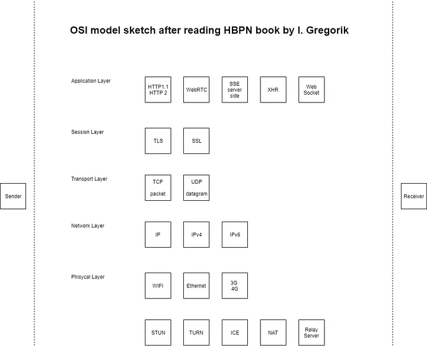

This is a big book on performance for web developers. I am writing this article especially for myself as a reminder of the many things that can be improved in our apps and servers.  

What this book is about? In the words of the author:

    “ How the network works, why it works the way it does and what you can do to optimize it ”

### Key points and lessons learned

Understand __bandwidth__ (measured in Mbps) vs latency (measured in ms). Need to transfer many small pieces? Latency is priority. Need to send big files over same pipe others are transferring big files? Bandwidth is more important.

__Throughput__ indicates the level of successful packet delivery from one point on the network to another.

__Latency__ is the performance bottleneck for most websites

For the user, once a 300 millisecond delay threshold is exceeded, the interaction is often reported as “sluggish”.

Most modern browsers, both desktop and mobile, can open up to six connections per host.

The fastest request is the one not made. Reduce transfer size, reuse cached content on client, reuse connections.

The rate with which a TCP connection can transfer data is often limited by the round-trip time between the receiver and sender.

__TCP__ is optimized for long-lived connections and bulk data transfers.

__UDP__ or Unreliable datagram protocol is a faster, simplified version of the TCP protocol. It does not provide any guarantee of message delivery, order delivery, state tracking and congestion control. UDP needs a lot of work to be optimized so it is more convenient to use WebRTC (real time communication).

__SSL__ (secure sockets layer) developed at Netscape to enable e-commerce transaction security on the web standardized as TLS.

__TLS__ (transport layer security) protocol designed to provide three essential services to all applications running above it: encryption, authentication, and data integrity

The best way to minimize both latency and computational overhead of setting up new connections is to optimize connection reuse.

To get the best security and performance guarantees it is critical that the site actually uses HTTPS to fetch all of its resources.

### Intermediaries between your source and destination

“new protocols and extensions to HTTP, such as WebSocket, HTTP/2, and others, have to rely on establishing an HTTPS tunnel to bypass the intermediate proxies and provide a reliable deployment model: the encrypted tunnel obfuscates the data from all intermediaries.”

### Optimizing for mobile phones

Phone’s radio component is often second in power consumption only to the screen.

Minimize use of radio interface. Do not fire keepalive signals if not absolutely necessary, it can drain the battery very fast.

Do not couple user interactions, user feedback, and network communication. If a network request is required, then initiate it in the background, and provide immediate UI feedback to acknowledge user input.

Signal availability is very unpredictable and your app should be able to work offline.

Group your requests together and transfer as much as possible, then let the radio return to idle

__HTTP 1.1__ features keep-alive connections, chunked encoding transfers, byte-range requests, additional caching mechanisms, transfer encoding, and request pipe-lining.

__HTTP 2__ features many enhancements such as compression of HTTP header fields, request prioritization and server push, stream prioritization, request and response multiplexing.

Since HTTP 2 works with streams it needs different optimizations techniques compared to HTTP 1. Chapter Optimizing Application Delivery offers a great list of optimizations for each.

__XHR__ used for async request. Not suitable for real time apps.

__SSE__ only server-to-client streaming of text-based UTF-8 real-time data. Binary data transfer is inefficient

__WebSocket__ allows bidirectional communication over the same TCP connection. Requires careful performance tuning. Real-time push can bring a big cost to mobile devices.

__WebRTC__ for Peer-to-peer audio and video streaming. Direct one to one communication can be simple, but it gets much more complicated between multiple peers.

The book is available online here.  
https://hpbn.co/

### Other tools and resources

Measure performance with the Navigation Timing API. Offers metrics that are not accessible with dev tools.  
https://developer.mozilla.org/en-US/docs/Web/API/Navigation_timing_API

High Performance Networking in Google Chrome
https://hpbn.co/chrome-networking

### In conclusion
There are many more useful lessons if you read the book. I found the WebRTC chapter to be the most difficult one to read because of all the details involving the optimizations of the UDP layer.

If you did not read this book yet, it is really worth the effort of going through the 400 pages. It was really interesting to read about how the mobile networks work, what the OSI model looks like for the web and what happens to your precious packets or datagrams in their journey across different environments.

Have fun learning!