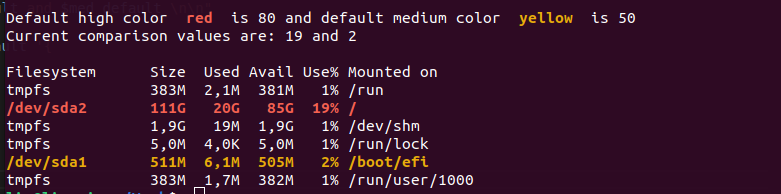

This article is the result of a random conversation, stirring my curiosity about how to colorize the Linux command line output. Yes I'm a geek. 

Idea: given the output of df -h command (shows disk usage in a neat table), color lines where disk usage is above some value you need start worry or take action.

Last time I encountered the need to colorize terminal a few years ago, after installing zsh, I wanted to add more info to the terminal prompt.

Was it required? No. Did I waste time? Yes. Was it fun? Definitely! So here I am again looking how to colorize command outputs this time.

If you think customizing things in the terminal cant be fun, checkout "there is a cow in my terminal" article: https://itsfoss.com/cowsay

Initially i started out looking for any way to colorize the output of any command in a regular Linux terminal.

At the base of it there is the __ANSI character escape sequence__. It looks like this:
```
\033[XXXm
```
Where XXX is a series of semicolon-separated parameters, not a movie rating. Checkout source for this and a great explanation here:

 https://stackoverflow.com/questions/4842424/list-of-ansi-color-escape-sequences


### This ANSI thing is wild and an entire historical computer rabbit hole to get into:

There is ANSI art

 https://en.wikipedia.org/wiki/ANSI_art

Bulletin board service in the 90'

 https://en.wikipedia.org/wiki/Bulletin_board_system

Text editors to create ANSI animations

 https://en.wikipedia.org/wiki/TheDraw

And probably more but I'm getting hungry and want to finish writing this article so, moving on.

After trying some simple things like below:
```
echo -e 'hello! \033[31m Colored text'
```
which prints everything after \033[31m in red text, I looked at comparing sed and awk. Both extremely powerful data manipulation commands. See one of many comparisons here:

 https://techcolleague.com/sed-vs-awk/

Based on these comparisons I leaned more to awk for our current experiment of colorizing text based on multiple rules.

### Fun fact! 

Or scary, depending on what you need to get done:

awk is an entire programming language inside a command. There is a whole book about it:

 https://www.gnu.org/software/gawk/manual/gawk.html

### Trying AI tools.

First i looked at the manual for awk and in the book mentioned, but why not throw in some recommendations from the robot.

Since I never used awk, one of the mighty AI tools came in handy to generate a starter script and this is the result, but with a flaw. Can you see it?
```
df -h | awk '{
  if ( $5 >= 80 ) {
    printf "\033[1;33m%s\033[0m\n", $0;
  }
  else { print; }
}'
```
The result of the coloring is wrong. It colors in yellow any row where the percentage of Use that is above 8, not 80.


### What a wonderful day to debug. And based on that statement, most of my days are wonderful.

A bit about what I understand awk is doing: 

Numbers with letters or symbols attached are considered by awk to be of type string. This is why the script above fails.

The output data of df -h command looks like this sample. The "$5" is the fifth column, aka "5th field" in a "record" (text row).
```
 Filesystem     Size      Used   Avail   Use%   Mounted on
  /dev/sda1       100G   10G     90G     10%     /
  /dev/sda2       100G   60G     40G     60%     /
```
When asked about the flaw AI generated the following, which again, is not working:
```
 substr($5, 1, length($5)-1);
```
This however, works. There is a + at the beginning for converting the string to a number
```
 +substr($5, 1, length($5)-1);
```
Success, the conversion to number finally worked. This is the result:



Partial capture of terminal output for the df -h command

Added some more teaks to keep the column formatting and spacing, and some default values. 

### This is the script if you want to try it out

https://github.com/LiviuLvu/gist-some-scripting/blob/main/colorize_out.sh

Don't forget to chmod +x the file if you want to try out the script locally.

So that about solves my curiosity to color the lines of an output based on custom rules.

What about you? Please share a link to fun customization you have seen or done for your terminal output.
